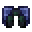

# Armorsaurus Leggings

<small>[Tensura: Reincarnated](../../index.md) &rsaquo; [Items](../index.md) &rsaquo; [Armor](index.md)</small>

| | |
|---|---|
| **ID** | `tensura:armorsaurus_leggings` |
| **Category** | Armor |
| **Gear EP** | 6,000 - None |
| **Armor** | 8 |
| **Armor toughness** | 4 |
| **Knockback resistance** | 50% |
| **Durability** | 600 |

## What it does

Armorsaurus armor for the leggings slot: **8** armor, **4** toughness and **50%** knockback resistance. Durability: **600**.

## Tags

`minecraft:leg_armor`, `tensura:body_armor_items`
