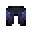
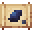

# Armorsaurus Scalemail Leggings

<small>[Tensura: Reincarnated](../../index.md) &rsaquo; [Items](../index.md) &rsaquo; [Armor](index.md)</small>

| | |
|---|---|
| **ID** | `tensura:armorsaurus_scalemail_leggings` |
| **Category** | Armor |
| **Gear EP** | 6,000 - None |
| **Armor** | 7 |
| **Armor toughness** | 3 |
| **Knockback resistance** | 40% |
| **Durability** | 570 |

## What it does

Armorsaurus Scalemail armor for the leggings slot: **7** armor, **3** toughness and **40%** knockback resistance. Durability: **570**. It is made at the Smithing Bench.

## Obtaining

### Recipes

**Smithing Bench** &rarr;  [Armorsaurus Scalemail Leggings](armorsaurus-scalemail-leggings.md)

Ingredients:  [Armorsaurus Scale](../materials/armorsaurus-scale.md) x7,  [Monster Leather (D)](../miscellaneous/monster-leather-d.md) x2

Requires schematic:  [Armorsaurus Scalemail Gear Schematic](../schematics/armorsaurus-scalemail-gear-schematic.md)

## Tags

`minecraft:leg_armor`
