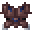
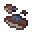
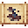

# Knight Spider Carapace Chestplate

<small>[Tensura: Reincarnated](../../index.md) &rsaquo; [Items](../index.md) &rsaquo; [Armor](index.md)</small>

| | |
|---|---|
| **ID** | `tensura:knight_spider_carapace_chestplate` |
| **Category** | Armor |
| **Gear EP** | 9,000 - None |

## Obtaining

### Recipes

**Smithing Bench** &rarr;  [Knight Spider Carapace Chestplate](knight-spider-carapace-chestplate.md)

Ingredients:  [Knight Spider Carapace](../miscellaneous/knight-spider-carapace.md) x8,  [Monster Leather (D)](../miscellaneous/monster-leather-d.md) x3

Requires schematic:  [Knight Spider Carapace Gear Schematic](../schematics/knight-spider-carapace-gear-schematic.md)

## Tags

`minecraft:chest_armor`
