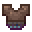
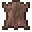
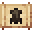

# Monster Leather Chestplate (D)

<small>[Tensura: Reincarnated](../../index.md) &rsaquo; [Items](../index.md) &rsaquo; [Armor](index.md)</small>

| | |
|---|---|
| **ID** | `tensura:monster_leather_chestplate_d` |
| **Category** | Armor |
| **Gear EP** | 1,000 - 2,500 |
| **Evolves into** | [Monster Leather Chestplate (C)](monster-leather-chestplate-c.md) |
| **Armor** | 5 |
| **Armor toughness** | 0.5 |
| **Knockback resistance** | 10% |

## What it does

Monster Leather D armor for the chestplate slot: **5** armor, **0.5** toughness and **10%** knockback resistance. It is made at the Smithing Bench.

## Obtaining

### Recipes

**Smithing Bench** &rarr;  [Monster Leather Chestplate (D)](monster-leather-chestplate-d.md)

Ingredients:  [Monster Leather (D)](../miscellaneous/monster-leather-d.md) x8

Requires schematic:  [Monster Leather Gear Schematic](../schematics/monster-leather-gear-schematic.md)

## Tags

`minecraft:chest_armor`, `minecraft:freeze_immune_wearables`
