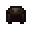

# Monster Leather Helmet (B)

<small>[Tensura: Reincarnated](../../index.md) &rsaquo; [Items](../index.md) &rsaquo; [Armor](index.md)</small>

| | |
|---|---|
| **ID** | `tensura:monster_leather_helmet_b` |
| **Category** | Armor |
| **Gear EP** | 5,000 - 8,000 |
| **Evolves into** | [Monster Leather Helmet (A)](monster-leather-helmet-a.md) |

## Obtaining

### Recipes

**Smithing Bench** &rarr;  [Monster Leather Helmet (B)](monster-leather-helmet-b.md)

Ingredients:  [Monster Leather (B)](../miscellaneous/monster-leather-b.md) x5

Requires schematic:  [Monster Leather Gear Schematic](../schematics/monster-leather-gear-schematic.md)

## Tags

`minecraft:freeze_immune_wearables`, `minecraft:head_armor`, `tensura:peacock_sitting_helmets`
