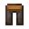

# Monster Leather Leggings (D)

<small>[Tensura: Reincarnated](../../index.md) &rsaquo; [Items](../index.md) &rsaquo; [Armor](index.md)</small>

| | |
|---|---|
| **ID** | `tensura:monster_leather_leggings_d` |
| **Category** | Armor |
| **Gear EP** | 1,000 - 2,500 |
| **Evolves into** | [Monster Leather Leggings (C)](monster-leather-leggings-c.md) |

## Obtaining

### Recipes

**Smithing Bench** &rarr;  [Monster Leather Leggings (D)](monster-leather-leggings-d.md)

Ingredients:  [Monster Leather (D)](../miscellaneous/monster-leather-d.md) x7

Requires schematic:  [Monster Leather Gear Schematic](../schematics/monster-leather-gear-schematic.md)

## Tags

`minecraft:freeze_immune_wearables`, `minecraft:leg_armor`
