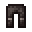

# Monster Leather Leggings (Special A)

<small>[Tensura: Reincarnated](../../index.md) &rsaquo; [Items](../index.md) &rsaquo; [Armor](index.md)</small>

| | |
|---|---|
| **ID** | `tensura:monster_leather_leggings_special_a` |
| **Category** | Armor |
| **Fire resistant** | Yes |
| **Gear EP** | 80,000 - None |
| **Armor** | 12 |
| **Armor toughness** | 7.5 |
| **Knockback resistance** | 80% |

## What it does

Monster Leather Special A armor for the leggings slot: **12** armor, **7.5** toughness and **80%** knockback resistance. It is made at the Smithing Bench.

## Obtaining

### Recipes

**Smithing Bench** &rarr;  [Monster Leather Leggings (Special A)](monster-leather-leggings-special-a.md)

Ingredients:  [Monster Leather (Special A)](../miscellaneous/monster-leather-special-a.md) x7

Requires schematic:  [Monster Leather Gear Schematic](../schematics/monster-leather-gear-schematic.md)

## Tags

`minecraft:freeze_immune_wearables`, `minecraft:leg_armor`
