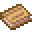

# Battlewill Manual

<small>[Tensura: Reincarnated](../../index.md) &rsaquo; [Items](../index.md) &rsaquo; [Books &amp; Scrolls](index.md)</small>

| | |
|---|---|
| **ID** | `tensura:battlewill_manual` |
| **Category** | Books &amp; Scrolls |
| **Stack size** | 1 |
| **Rarity** | Rare |
| **Fire resistant** | Yes |

## What it does

A manual that teaches a battlewill (a combat art). Hold right-click for at least half a second: you learn the battlewill written in it, or a random one from the config's battlewill list if the manual is blank. If you already know it, the manual is still used up. After reading, manuals are on a 10-second cooldown. Mobs can drop them and dwarf battlewill trainers sell them.

It is found in 7 kinds of loot chest.

## Obtaining

### Loot

| Source | Count | Chance | Notes |
|---|---|---|---|
| Chest: Dwarf Library (`tensura:chests/dwarf_library`) | 1 | 20% |  |
| Chest: Dwarf Dojo (`tensura:chests/dwarf_dojo`) | 1 | 19% |  |
| Chest: Dwarf Dojo (`tensura:chests/dwarf_dojo`) | 1 | 9.4% |  |
| Chest: Dwarf Dojo (`tensura:chests/dwarf_dojo`) | 1 | 9.4% |  |
| Chest: Lizardman Bedroom (`tensura:chests/lizardman_bedroom`) | 1 | 5.7% |  |
| Chest: Dwarf Dojo (`tensura:chests/dwarf_dojo`) | 1 | 4.7% |  |
| Archaeology: Ant Nest | 1 | 2.4% |  |
| Chest: Dwarf Dojo (`tensura:chests/dwarf_dojo`) | 1 | 0.94% |  |

## Tags

`minecraft:bookshelf_books`
