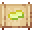

# Skill Reset Scroll

<small>[Tensura: Reincarnated](../../index.md) &rsaquo; [Items](../index.md) &rsaquo; [Books &amp; Scrolls](index.md)</small>

| | |
|---|---|
| **ID** | `tensura:skill_reset_scroll` |
| **Category** | Books &amp; Scrolls |
| **Stack size** | 1 |

## Obtaining

### Recipes

**Crafting (shaped)** &rarr;  [Skill Reset Scroll](skill-reset-scroll.md)

| | | |
|---|---|---|
|  [Paper](https://minecraft.wiki/w/Paper) |  [Pure Magisteel Ingot](../materials/pure-magisteel-ingot.md) |  [Paper](https://minecraft.wiki/w/Paper) |
|  [Orichalcum Ingot](../materials/orichalcum-ingot.md) |  [Magic Stone](../materials/magic-stone.md) |  [Orichalcum Ingot](../materials/orichalcum-ingot.md) |
|  [Monster Leather (A)](../miscellaneous/monster-leather-a.md) |  [Paper](https://minecraft.wiki/w/Paper) |  [Monster Leather (A)](../miscellaneous/monster-leather-a.md) |

**Smithing Bench** &rarr;  [Skill Reset Scroll](skill-reset-scroll.md)

Ingredients:  [Orichalcum Ingot](../materials/orichalcum-ingot.md) x2,  [Pure Magisteel Ingot](../materials/pure-magisteel-ingot.md),  [Magic Stone](../materials/magic-stone.md),  [Monster Leather (A)](../miscellaneous/monster-leather-a.md) x2,  [Paper](https://minecraft.wiki/w/Paper) x3

Requires schematic:  [Orichalcum Gear Schematic](../schematics/orichalcum-gear-schematic.md)

## Tags

`tensura:reset_scrolls`
