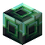

# Adamantite Ingot

<small>[Tensura: Reincarnated](../../index.md) &rsaquo; [Items](../index.md) &rsaquo; [Materials](index.md)</small>

| | |
|---|---|
| **ID** | `tensura:adamantite_ingot` |
| **Category** | Materials |
| **Fire resistant** | Yes |
| **Magicule when dissolved** | 100,000 |

## Obtaining

### Recipes

**Crafting (shaped)** &rarr;  [Adamantite Ingot](adamantite-ingot.md)

| | | |
|---|---|---|
|  [Adamantite Nugget](adamantite-nugget.md) |  [Adamantite Nugget](adamantite-nugget.md) |  [Adamantite Nugget](adamantite-nugget.md) |
|  [Adamantite Nugget](adamantite-nugget.md) |  [Adamantite Nugget](adamantite-nugget.md) |  [Adamantite Nugget](adamantite-nugget.md) |
|  [Adamantite Nugget](adamantite-nugget.md) |  [Adamantite Nugget](adamantite-nugget.md) |  [Adamantite Nugget](adamantite-nugget.md) |

**Crafting (shapeless)** &rarr;  [Adamantite Ingot](adamantite-ingot.md) x9

Ingredients:  [Block of Adamantite](../../blocks/adamantite-block.md)

## Used in

[Adamantite Nugget](adamantite-nugget.md), [Block of Adamantite](../../blocks/adamantite-block.md), [Adamantite Axe](../tools/adamantite-axe.md), [Adamantite Boots](../armor/adamantite-boots.md), [Adamantite Chestplate](../armor/adamantite-chestplate.md), [Adamantite Great Sword](../weapons/adamantite-great-sword.md), [Adamantite Helmet](../armor/adamantite-helmet.md), [Adamantite Hoe](../tools/adamantite-hoe.md), [Adamantite Katana](../weapons/adamantite-katana.md), [Adamantite Kodachi](../weapons/adamantite-kodachi.md), [Adamantite Leggings](../armor/adamantite-leggings.md), [Adamantite Long Sword](../weapons/adamantite-long-sword.md), [Adamantite Odachi](../weapons/adamantite-odachi.md), [Adamantite Pickaxe](../tools/adamantite-pickaxe.md), [Adamantite Scythe](../weapons/adamantite-scythe.md), [Adamantite Short Sword](../weapons/adamantite-short-sword.md), [Adamantite Shovel](../tools/adamantite-shovel.md), [Adamantite Sickle](../tools/adamantite-sickle.md), [Adamantite Spear](../weapons/adamantite-spear.md), [Adamantite Sword](../weapons/adamantite-sword.md), [Adamantite Tachi](../weapons/adamantite-tachi.md)

## Tags

`c:ingots`, `minecraft:trim_materials`, `tensura:adamantite_items`
