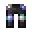

# Hihi'Irokane Nugget

<small>[Tensura: Reincarnated](../../index.md) &rsaquo; [Items](../index.md) &rsaquo; [Materials](index.md)</small>

| | |
|---|---|
| **ID** | `tensura:hihiirokane_nugget` |
| **Category** | Materials |
| **Fire resistant** | Yes |

## What it does

Crafting material, used to make [Hihi'Irokane Ingot](hihiirokane-ingot.md). It is crafted, smelted in a blast furnace and smelted in a furnace.

## Obtaining

### Recipes

**Crafting (shapeless)** &rarr;  [Hihi'Irokane Nugget](hihiirokane-nugget.md) x9

Ingredients:  [Hihi'Irokane Ingot](hihiirokane-ingot.md)

**Blasting** &rarr;  [Hihi'Irokane Nugget](hihiirokane-nugget.md)

Ingredients:  [Hihi'Irokane Boots](../armor/hihiirokane-boots.md)

**Blasting** &rarr;  [Hihi'Irokane Nugget](hihiirokane-nugget.md)

Ingredients:  [Hihi'Irokane Chestplate](../armor/hihiirokane-chestplate.md)

**Blasting** &rarr;  [Hihi'Irokane Nugget](hihiirokane-nugget.md)

Ingredients:  [Hihi'Irokane Helmet](../armor/hihiirokane-helmet.md)

**Blasting** &rarr;  [Hihi'Irokane Nugget](hihiirokane-nugget.md)

Ingredients:  [Hihi'Irokane Leggings](../armor/hihiirokane-leggings.md)

**Smelting** &rarr;  [Hihi'Irokane Nugget](hihiirokane-nugget.md)

Ingredients:  [Hihi'Irokane Boots](../armor/hihiirokane-boots.md)

**Smelting** &rarr;  [Hihi'Irokane Nugget](hihiirokane-nugget.md)

Ingredients:  [Hihi'Irokane Chestplate](../armor/hihiirokane-chestplate.md)

**Smelting** &rarr;  [Hihi'Irokane Nugget](hihiirokane-nugget.md)

Ingredients:  [Hihi'Irokane Helmet](../armor/hihiirokane-helmet.md)

**Smelting** &rarr;  [Hihi'Irokane Nugget](hihiirokane-nugget.md)

Ingredients:  [Hihi'Irokane Leggings](../armor/hihiirokane-leggings.md)

## Used in

[Hihi'Irokane Ingot](hihiirokane-ingot.md)

## Tags

`c:nuggets`, `tensura:hihiirokane_items`
