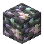
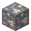

# Magic Ore

<small>[Tensura: Reincarnated](../../index.md) &rsaquo; [Items](../index.md) &rsaquo; [Materials](index.md)</small>

| | |
|---|---|
| **ID** | `tensura:magic_ore_shard` |
| **Category** | Materials |
| **Magicule when dissolved** | 5,000 |

## What it does

Crafting material, used to make [Block of Magic Ore](../../blocks/magic-ore-block.md) and [Pure Magisteel Nugget](pure-magisteel-nugget.md). It is crafted, made at the Mining Station, dropped by [Metal Slime](../../mobs/metal-slime.md), dropped when you break [Deepslate Magic Ore](../../blocks/deepslate-magic-ore.md), [Magic Ore](../../blocks/magic-ore.md), [Magic Cluster](../../../elite-tensura/blocks/magic-ore-cluster.md) and [Large Magic Bud](../../../elite-tensura/blocks/magic-ore-large-bud.md) and found in 1 kind of loot chest.

## Obtaining

### Recipes

**Crafting (shapeless)** &rarr;  [Magic Ore](magic-ore-shard.md) x9

Ingredients:  [Block of Magic Ore](../../blocks/magic-ore-block.md)

**Mining Station** &rarr;  [Magic Ore](magic-ore-shard.md)

Ingredients:  [Deepslate Magic Ore](../../blocks/deepslate-magic-ore.md)

**Mining Station** &rarr;  [Magic Ore](magic-ore-shard.md)

Ingredients:  [Magic Ore](../../blocks/magic-ore.md)

### Loot

| Source | Count | Chance | Notes |
|---|---|---|---|
| Breaking [Magic Cluster](../../../elite-tensura/blocks/magic-ore-cluster.md) | 2 | 100% |  |
| Breaking [Large Magic Bud](../../../elite-tensura/blocks/magic-ore-large-bud.md) | 1 | 100% |  |
| Breaking [Deepslate Magic Ore](../../blocks/deepslate-magic-ore.md) | 1 | 50% |  |
| Breaking [Magic Ore](../../blocks/magic-ore.md) | 1 | 50% |  |
| Dropped by [Metal Slime](../../mobs/metal-slime.md) | 5-8 | 50% | More with Looting |
| Chest: Hell Ruins (`tensura:chests/hell_ruins`) | 1 | 17% |  |
| Archaeology: Hell Ruins | 1 | 4.8% |  |

## Used in

[Block of Magic Ore](../../blocks/magic-ore-block.md), [Pure Magisteel Nugget](pure-magisteel-nugget.md)

## Tags

`tensura:metal_slime_taming_food`, `tensura:slime_food`
