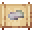

# Medium Quality Magic Crystal

<small>[Tensura: Reincarnated](../../index.md) &rsaquo; [Items](../index.md) &rsaquo; [Materials](index.md)</small>

| | |
|---|---|
| **ID** | `tensura:medium_quality_magic_crystal` |
| **Category** | Materials |
| **Fire resistant** | Yes |
| **Magicule when dissolved** | 2,500 |

## Obtaining

### Recipes

**Crafting (shapeless)** &rarr;  [Medium Quality Magic Crystal](medium-quality-magic-crystal.md) x9

Ingredients:  [Medium Quality Magic Crystal Block](../../blocks/medium-quality-magic-crystal-block.md)

**Smithing Bench** &rarr;  [Medium Quality Magic Crystal](medium-quality-magic-crystal.md) x2

Ingredients:  [High Quality Magic Crystal](high-quality-magic-crystal.md)

Requires schematic:  [Low Magisteel Gear Schematic](../schematics/low-magisteel-gear-schematic.md)

## Used in

[Magic Bottle](../potions/magic-bottle.md), [Dubious Food](../miscellaneous/dubious-food.md), [Empty Element Core](../miscellaneous/element-core-empty.md), [Medium Quality Magic Crystal Block](../../blocks/medium-quality-magic-crystal-block.md), [Low Quality Magic Crystal](low-quality-magic-crystal.md)

## Tags

`tensura:dubious/ingredient_crystal`, `tensura:slime_taming_food`, `tensura:spirit_food`
