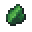

# Armorsaurus Shell

<small>[Tensura: Reincarnated](../../index.md) &rsaquo; [Items](../index.md) &rsaquo; [Miscellaneous](index.md)</small>

| | |
|---|---|
| **ID** | `tensura:armorsaurus_shell` |
| **Category** | Miscellaneous |
| **Magicule when dissolved** | 150 |

## What it does

Crafting material, used to make [Armorsaurus Shield](armorsaurus-shield.md). It is dropped by [Armorsaurus](../../mobs/armorsaurus.md).

## Obtaining

### Loot

| Source | Count | Chance | Notes |
|---|---|---|---|
| Dropped by [Armorsaurus](../../mobs/armorsaurus.md) | 2-3 | 100% |  |

## Used in

[Armorsaurus Shield](armorsaurus-shield.md)
