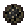

# Black Fire Charge

<small>[Tensura: Reincarnated](../../index.md) &rsaquo; [Items](../index.md) &rsaquo; [Miscellaneous](index.md)</small>

| | |
|---|---|
| **ID** | `tensura:black_fire_charge` |
| **Category** | Miscellaneous |
| **Fire resistant** | Yes |

## What it does

A creative-only fire charge that sets [Black Fire](../../blocks/black-fire.md) (or lights campfires and candles).
