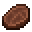

# Blade Tiger Steak

<small>[Tensura: Reincarnated](../../index.md) &rsaquo; [Items](../index.md) &rsaquo; [Miscellaneous](index.md)</small>

| | |
|---|---|
| **ID** | `tensura:blade_tiger_steak` |
| **Category** | Miscellaneous |
| **Magicule when dissolved** | 42 |

## What it does

Food. It is smelted in a furnace, cooked on a campfire and cooked in a smoker.

## Obtaining

### Recipes

**Smelting** &rarr;  [Blade Tiger Steak](blade-tiger-steak.md)

Ingredients:  [Raw Blade Tiger Meat](raw-blade-tiger-meat.md)

**Campfire** &rarr;  [Blade Tiger Steak](blade-tiger-steak.md)

Ingredients:  [Raw Blade Tiger Meat](raw-blade-tiger-meat.md)

**Smoking** &rarr;  [Blade Tiger Steak](blade-tiger-steak.md)

Ingredients:  [Raw Blade Tiger Meat](raw-blade-tiger-meat.md)

## Tags

`minecraft:meat`, `tensura:cooked_monster_consumables`
