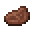

# Cattledeer Steak

<small>[Tensura: Reincarnated](../../index.md) &rsaquo; [Items](../index.md) &rsaquo; [Miscellaneous](index.md)</small>

| | |
|---|---|
| **ID** | `tensura:cattledeer_steak` |
| **Category** | Miscellaneous |
| **Magicule when dissolved** | 30 |

## What it does

Food. It is smelted in a furnace, cooked on a campfire and cooked in a smoker.

## Obtaining

### Recipes

**Smelting** &rarr;  [Cattledeer Steak](cattledeer-steak.md)

Ingredients:  [Cattledeer Beef](cattledeer-beef.md)

**Campfire** &rarr;  [Cattledeer Steak](cattledeer-steak.md)

Ingredients:  [Cattledeer Beef](cattledeer-beef.md)

**Smoking** &rarr;  [Cattledeer Steak](cattledeer-steak.md)

Ingredients:  [Cattledeer Beef](cattledeer-beef.md)

## Tags

`minecraft:meat`, `tensura:bear_food`, `tensura:cooked_monster_consumables`
