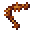

# Cooked Giant Ant Leg

<small>[Tensura: Reincarnated](../../index.md) &rsaquo; [Items](../index.md) &rsaquo; [Miscellaneous](index.md)</small>

| | |
|---|---|
| **ID** | `tensura:cooked_giant_ant_leg` |
| **Category** | Miscellaneous |
| **Magicule when dissolved** | 36 |

## What it does

Food that restores **12** hunger (6 shanks) and **19.2** saturation. It is smelted in a furnace, cooked on a campfire and cooked in a smoker.

## Obtaining

### Recipes

**Smelting** &rarr;  [Cooked Giant Ant Leg](cooked-giant-ant-leg.md)

Ingredients:  [Giant Ant Leg](giant-ant-leg.md)

**Campfire** &rarr;  [Cooked Giant Ant Leg](cooked-giant-ant-leg.md)

Ingredients:  [Giant Ant Leg](giant-ant-leg.md)

**Smoking** &rarr;  [Cooked Giant Ant Leg](cooked-giant-ant-leg.md)

Ingredients:  [Giant Ant Leg](giant-ant-leg.md)

## Tags

`tensura:cooked_monster_consumables`
