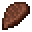

# Cooked Giant Bat Meat

<small>[Tensura: Reincarnated](../../index.md) &rsaquo; [Items](../index.md) &rsaquo; [Miscellaneous](index.md)</small>

| | |
|---|---|
| **ID** | `tensura:cooked_giant_bat_meat` |
| **Category** | Miscellaneous |
| **Magicule when dissolved** | 36 |

## What it does

Food that restores **12** hunger (6 shanks) and **19.2** saturation. Eating it gives [Infection](../../effects/infection.md) for 45 s (3% chance). It is smelted in a furnace, cooked on a campfire and cooked in a smoker.

## Obtaining

### Recipes

**Smelting** &rarr;  [Cooked Giant Bat Meat](cooked-giant-bat-meat.md)

Ingredients:  [Raw Giant Bat Meat](raw-giant-bat-meat.md)

**Campfire** &rarr;  [Cooked Giant Bat Meat](cooked-giant-bat-meat.md)

Ingredients:  [Raw Giant Bat Meat](raw-giant-bat-meat.md)

**Smoking** &rarr;  [Cooked Giant Bat Meat](cooked-giant-bat-meat.md)

Ingredients:  [Raw Giant Bat Meat](raw-giant-bat-meat.md)

## Tags

`minecraft:meat`, `tensura:cooked_monster_consumables`
