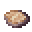
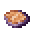

# Cooked Sissie Meat

<small>[Tensura: Reincarnated](../../index.md) &rsaquo; [Items](../index.md) &rsaquo; [Miscellaneous](index.md)</small>

| | |
|---|---|
| **ID** | `tensura:cooked_sissie_meat` |
| **Category** | Miscellaneous |
| **Magicule when dissolved** | 36 |

## Obtaining

### Recipes

**Smelting** &rarr;  [Cooked Sissie Meat](cooked-sissie-meat.md)

Ingredients:  [Raw Sissie Meat](raw-sissie-meat.md)

**Campfire** &rarr;  [Cooked Sissie Meat](cooked-sissie-meat.md)

Ingredients:  [Raw Sissie Meat](raw-sissie-meat.md)

**Smoking** &rarr;  [Cooked Sissie Meat](cooked-sissie-meat.md)

Ingredients:  [Raw Sissie Meat](raw-sissie-meat.md)

## Tags

`c:foods/cooked_fish`, `minecraft:fishes`, `tensura:cooked_monster_consumables`
