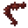

# Dubious Food

<small>[Tensura: Reincarnated](../../index.md) &rsaquo; [Items](../index.md) &rsaquo; [Miscellaneous](index.md)</small>

| | |
|---|---|
| **ID** | `tensura:dubious_food` |
| **Category** | Miscellaneous |
| **Magicule when dissolved** | 300 |

## What it does

Food. It is crafted.

## Obtaining

### Recipes

**Crafting (shapeless)** &rarr;  [Dubious Food](dubious-food.md)

Ingredients:  `#tensura:dubious/ingredient_poison`,  `#tensura:dubious/ingredient_magic`,  `#tensura:dubious/ingredient_raw`,  `#tensura:dubious/ingredient_effect`,  `#tensura:dubious/ingredient_crystal`,  `#tensura:dubious/ingredient_brewing`,  `#tensura:dubious/ingredient_mushroom`,  `#tensura:raw_monster_consumables`,  `#minecraft:small_flowers`
