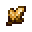

# Element Core (Earth)

<small>[Tensura: Reincarnated](../../index.md) &rsaquo; [Items](../index.md) &rsaquo; [Miscellaneous](index.md)</small>

| | |
|---|---|
| **ID** | `tensura:element_core_earth` |
| **Category** | Miscellaneous |
| **Durability** | 500 |
| **Fire resistant** | Yes |

## What it does

It is crafted.

## Obtaining

### Recipes

**Crafting (shaped)** &rarr;  [Element Core (Earth)](element-core-earth.md)

| | | |
|---|---|---|
|  [Elemental Shard (Earth)](../materials/earth-elemental-shard.md) |  [Elemental Shard (Earth)](../materials/earth-elemental-shard.md) |  [Elemental Shard (Earth)](../materials/earth-elemental-shard.md) |
|  [Elemental Shard (Earth)](../materials/earth-elemental-shard.md) |  [Empty Element Core](element-core-empty.md) |  [Elemental Shard (Earth)](../materials/earth-elemental-shard.md) |
|  [Elemental Shard (Earth)](../materials/earth-elemental-shard.md) |  [Elemental Shard (Earth)](../materials/earth-elemental-shard.md) |  [Elemental Shard (Earth)](../materials/earth-elemental-shard.md) |

## Tags

`tensura:elemental_cores`
