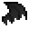

# Giant Bat Wing

<small>[Tensura: Reincarnated](../../index.md) &rsaquo; [Items](../index.md) &rsaquo; [Miscellaneous](index.md)</small>

| | |
|---|---|
| **ID** | `tensura:giant_bat_wing` |
| **Category** | Miscellaneous |
| **Magicule when dissolved** | 400 |

## Obtaining

### Loot

| Source | Count | Chance | Notes |
|---|---|---|---|
| Dropped by [Giant Bat](../../mobs/giant-bat.md) | 0-2 | 100% | More with Looting |

## Used in

[Bat Glider](bat-glider.md)
