# Miscellaneous

<small>[Tensura: Reincarnated](../../index.md) &rsaquo; [Items](../index.md)</small>

| | Name | Description |
|---|---|---|
| 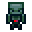 | [Adamantite Bone Golem](adamantite-bone-golem.md) |  |
|  | [Armorsaurus Shell](armorsaurus-shell.md) |  |
|  | [Armorsaurus Shield](armorsaurus-shield.md) |  |
|  | [Bat Glider](bat-glider.md) |  |
|  | [Black Fire Charge](black-fire-charge.md) |  |
|  | [Blade Tiger Steak](blade-tiger-steak.md) |  |
|  | [Blade Tiger Tail](blade-tiger-tail.md) |  |
|  | [Bronze Coin](bronze-coin.md) |  |
|  | [Cattledeer Beef](cattledeer-beef.md) |  |
| 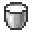 | [Cattledeer Milk Bucket](bucket-of-cattledeer-milk.md) |  |
|  | [Cattledeer Steak](cattledeer-steak.md) |  |
|  | [Centipede Stinger](centipede-stinger.md) |  |
|  | [Chilled Slime](chilled-slime.md) |  |
|  | [Coin Pouch (A)](pouch-a.md) |  |
| 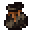 | [Coin Pouch (B)](pouch-b.md) |  |
| 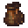 | [Coin Pouch (C)](pouch-c.md) |  |
| 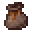 | [Coin Pouch (D)](pouch-d.md) |  |
|  | [Coin Pouch (Special A)](pouch-special-a.md) |  |
| 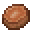 | [Cooked Armorsaurus Meat](cooked-armorsaurus-meat.md) |  |
| 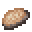 | [Cooked Charybdis Meat](cooked-charybdis-meat.md) |  |
|  | [Cooked Giant Ant Leg](cooked-giant-ant-leg.md) |  |
|  | [Cooked Giant Bat Meat](cooked-giant-bat-meat.md) |  |
| 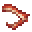 | [Cooked Knight Spider Leg](cooked-knight-spider-leg.md) |  |
|  | [Cooked Megalodon Meat](cooked-megalodon-meat.md) |  |
| 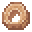 | [Cooked Serpent Meat](cooked-serpent-meat.md) |  |
| 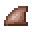 | [Cooked Sissie Fin](cooked-sissie-fin.md) |  |
|  | [Cooked Sissie Meat](cooked-sissie-meat.md) |  |
| 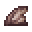 | [Cooked Spear Toro Fin](cooked-spear-toro-fin.md) |  |
|  | [Cooked Spear Toro Meat](cooked-spear-toro-meat.md) |  |
|  | [Copper Shell](copper-shell.md) |  |
|  | [Dragon Knuckle](dragon-knuckle.md) |  |
|  | [Dubious Food](dubious-food.md) |  |
|  | [Element Core (Earth)](element-core-earth.md) |  |
|  | [Element Core (Fire)](element-core-fire.md) |  |
|  | [Element Core (Space)](element-core-space.md) |  |
|  | [Element Core (Water)](element-core-water.md) |  |
|  | [Element Core (Wind)](element-core-wind.md) |  |
|  | [Empty Element Core](element-core-empty.md) |  |
|  | [Gehenna-Moth Silk](gehenna-moth-silk.md) |  |
|  | [Giant Ant Carapace](giant-ant-carapace.md) |  |
|  | [Giant Ant Leg](giant-ant-leg.md) |  |
|  | [Giant Bat Wing](giant-bat-wing.md) |  |
|  | [Gold Coin](gold-coin.md) |  |
|  | [Grimoire (A)](grimoire-a.md) |  |
|  | [Grimoire (B)](grimoire-b.md) |  |
|  | [Grimoire (C)](grimoire-c.md) |  |
|  | [Grimoire (D)](grimoire-d.md) |  |
|  | [Grimoire (Special A)](grimoire-special-a.md) |  |
|  | [Hell-Moth Silk](hell-moth-silk.md) |  |
|  | [High Magisteel Bone Golem](high-magisteel-bone-golem.md) |  |
|  | [Hihi'irokane Bone Golem](hihiirokane-bone-golem.md) |  |
|  | [Hipokute Flower](hipokute-flower.md) |  |
|  | [Hipokute Seeds](hipokute-seeds.md) |  |
| 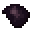 | [Insectar Carapace](insectar-carapace.md) |  |
|  | [Invisible Arrow](invisible-arrow.md) |  |
|  | [Knight Spider Carapace](knight-spider-carapace.md) |  |
| 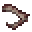 | [Knight Spider Leg](knight-spider-leg.md) |  |
|  | [Low Magisteel Bone Golem](low-magisteel-bone-golem.md) |  |
|  | [Marionette Heart](marionette-heart.md) | A rare magic item that can turn the user into a Majin with the cost of half their max HP in damage and most of their... |
|  | [Mithril Bone Golem](mithril-bone-golem.md) |  |
|  | [Monster Leather (A)](monster-leather-a.md) |  |
|  | [Monster Leather (B)](monster-leather-b.md) |  |
|  | [Monster Leather (C)](monster-leather-c.md) |  |
|  | [Monster Leather (D)](monster-leather-d.md) |  |
|  | [Monster Leather (Special A)](monster-leather-special-a.md) |  |
|  | [Monster Saddle](monster-saddle.md) |  |
|  | [Orb of Domination](orb-of-domination.md) |  |
|  | [Orichalcum Bone Golem](orichalcum-bone-golem.md) |  |
|  | [Palm Boat](palm-boat.md) |  |
|  | [Palm Boat with Chest](palm-chest-boat.md) |  |
|  | [Pure Magisteel Bone Golem](pure-magisteel-bone-golem.md) |  |
|  | [Raw Armorsaurus Meat](raw-armorsaurus-meat.md) |  |
|  | [Raw Blade Tiger Meat](raw-blade-tiger-meat.md) |  |
|  | [Raw Charybdis Meat](raw-charybdis-meat.md) |  |
|  | [Raw Giant Bat Meat](raw-giant-bat-meat.md) |  |
|  | [Raw Megalodon Meat](raw-megalodon-meat.md) |  |
|  | [Raw Serpent Meat](raw-serpent-meat.md) |  |
|  | [Raw Silver](raw-silver.md) |  |
|  | [Raw Sissie Meat](raw-sissie-meat.md) |  |
|  | [Raw Spear Toro Meat](raw-spear-toro-meat.md) |  |
|  | [Royal Blood](royal-blood.md) |  |
| 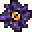 | [Shadow Storage](shadow-storage.md) | EP: ? |
|  | [Silver Coin](silver-coin.md) |  |
|  | [Sissie Fin](sissie-fin.md) |  |
|  | [Sissie Tooth](sissie-tooth.md) |  |
|  | [Slime Chunk](slime-chunk.md) |  |
|  | [Spatial Bag](spatial-bag.md) |  |
|  | [Spear Toro Fin](spear-toro-fin.md) |  |
|  | [Speared Fin Arrow](speared-fin-arrow.md) |  |
|  | [Steel Thread](steel-thread.md) |  |
|  | [Stellar Gold Coin](stellar-gold-coin.md) |  |
|  | [Sticky Steel Web Cartridge](sticky-steel-web-cartridge.md) |  |
|  | [Sticky Thread](sticky-thread.md) |  |
| 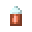 | [Sticky Web Cartridge](sticky-web-cartridge.md) |  |
|  | [Tempest Scale Shield](tempest-scale-shield.md) |  |
|  | [Thatch](thatch.md) |  |
| 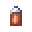 | [Web Cartridge](web-cartridge.md) |  |
|  | [Zane Blood](zane-blood.md) |  |
