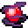

# Mithril Bone Golem

<small>[Tensura: Reincarnated](../../index.md) &rsaquo; [Items](../index.md) &rsaquo; [Miscellaneous](index.md)</small>

| | |
|---|---|
| **ID** | `tensura:mithril_bone_golem` |
| **Category** | Miscellaneous |
| **Rarity** | Epic |
| **Fire resistant** | Yes |

## What it does

Places a **Bone Golem** of this metal where you click (sneak while placing it and it floats instead of falling). A bone golem is a posable body, like an armor stand: sneak + right-click cycles its pose, and it can hold gear. Its EP and stats depend on the metal. Spirits can take it over with the [Possession](../../abilities/intrinsic-skills/possession.md) skill. Two quick hits break it and drop the item again.

It is crafted.

## Obtaining

### Recipes

**Crafting (shaped)** &rarr;  [Mithril Bone Golem](mithril-bone-golem.md)

| | | |
|---|---|---|
|  [Pure Magisteel Ingot](../materials/pure-magisteel-ingot.md) |  [Mithril Helmet](../armor/mithril-helmet.md) |  [Pure Magisteel Ingot](../materials/pure-magisteel-ingot.md) |
|  [Mithril Chestplate](../armor/mithril-chestplate.md) |  [Daemon Core](../materials/daemon-core.md) |  [Mithril Leggings](../armor/mithril-leggings.md) |
|  [Pure Magisteel Ingot](../materials/pure-magisteel-ingot.md) |  [Mithril Boots](../armor/mithril-boots.md) |  [Pure Magisteel Ingot](../materials/pure-magisteel-ingot.md) |

## Tags

`tensura:bone_golems`
