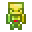
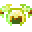
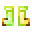

# Orichalcum Bone Golem

<small>[Tensura: Reincarnated](../../index.md) &rsaquo; [Items](../index.md) &rsaquo; [Miscellaneous](index.md)</small>

| | |
|---|---|
| **ID** | `tensura:orichalcum_bone_golem` |
| **Category** | Miscellaneous |
| **Rarity** | Epic |
| **Fire resistant** | Yes |

## Obtaining

### Recipes

**Crafting (shaped)** &rarr;  [Orichalcum Bone Golem](orichalcum-bone-golem.md)

| | | |
|---|---|---|
|  [Pure Magisteel Ingot](../materials/pure-magisteel-ingot.md) |  [Orichalcum Helmet](../armor/orichalcum-helmet.md) |  [Pure Magisteel Ingot](../materials/pure-magisteel-ingot.md) |
|  [Orichalcum Chestplate](../armor/orichalcum-chestplate.md) |  [Daemon Core](../materials/daemon-core.md) |  [Orichalcum Leggings](../armor/orichalcum-leggings.md) |
|  [Pure Magisteel Ingot](../materials/pure-magisteel-ingot.md) |  [Orichalcum Boots](../armor/orichalcum-boots.md) |  [Pure Magisteel Ingot](../materials/pure-magisteel-ingot.md) |

## Tags

`tensura:bone_golems`
