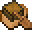
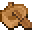

# Palm Boat with Chest

<small>[Tensura: Reincarnated](../../index.md) &rsaquo; [Items](../index.md) &rsaquo; [Miscellaneous](index.md)</small>

| | |
|---|---|
| **ID** | `tensura:palm_chest_boat` |
| **Category** | Miscellaneous |
| **Stack size** | 1 |

## What it does

It is crafted.

## Obtaining

### Recipes

**Crafting (shapeless)** &rarr;  [Palm Boat with Chest](palm-chest-boat.md)

Ingredients:  [Chest](https://minecraft.wiki/w/Chest),  [Palm Boat](palm-boat.md)
