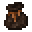

# Coin Pouch (A)

<small>[Tensura: Reincarnated](../../index.md) &rsaquo; [Items](../index.md) &rsaquo; [Miscellaneous](index.md)</small>

| | |
|---|---|
| **ID** | `tensura:pouch_a` |
| **Category** | Miscellaneous |
| **Stack size** | 1 |
| **Gear EP** | 8,000 - 80,000 |
| **Evolves into** | [Coin Pouch (Special A)](pouch-special-a.md) |

## What it does

A **coin pouch**: a bundle that only holds coins. Right-click coins onto it (or it onto coins) to store them, and coins you pick up go straight into it. It can't be put inside other containers. Pouches differ in capacity, counted in full stacks of coins: Coin Pouch (D) holds 4, (C) 8, (B) 12, (A) 16 and (Special A) 20.

It is crafted.

## Obtaining

### Recipes

**Crafting (shaped)** &rarr;  [Coin Pouch (A)](pouch-a.md)

| | | |
|---|---|---|
|   |  [String](https://minecraft.wiki/w/String) |   |
|  [Monster Leather (A)](monster-leather-a.md) |   |  [Monster Leather (A)](monster-leather-a.md) |
|   |  [Monster Leather (A)](monster-leather-a.md) |   |

## Tags

`tensura:pouches`
