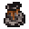

# Coin Pouch (Special A)

<small>[Tensura: Reincarnated](../../index.md) &rsaquo; [Items](../index.md) &rsaquo; [Miscellaneous](index.md)</small>

| | |
|---|---|
| **ID** | `tensura:pouch_special_a` |
| **Category** | Miscellaneous |
| **Stack size** | 1 |
| **Gear EP** | 80,000 - None |

## Obtaining

### Recipes

**Crafting (shaped)** &rarr;  [Coin Pouch (Special A)](pouch-special-a.md)

| | | |
|---|---|---|
|   |  [String](https://minecraft.wiki/w/String) |   |
|  [Monster Leather (Special A)](monster-leather-special-a.md) |   |  [Monster Leather (Special A)](monster-leather-special-a.md) |
|   |  [Monster Leather (Special A)](monster-leather-special-a.md) |   |

## Tags

`minecraft:indestructible_by_environmental_cause`, `tensura:pouches`
