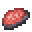

# Raw Charybdis Meat

<small>[Tensura: Reincarnated](../../index.md) &rsaquo; [Items](../index.md) &rsaquo; [Miscellaneous](index.md)</small>

| | |
|---|---|
| **ID** | `tensura:raw_charybdis_meat` |
| **Category** | Miscellaneous |
| **Magicule when dissolved** | 24 |

## What it does

Food. Used to make [Cooked Charybdis Meat](cooked-charybdis-meat.md) and [Dubious Food](dubious-food.md). It is dropped by [Charybdis](../../mobs/charybdis.md).

## Obtaining

### Loot

| Source | Count | Chance | Notes |
|---|---|---|---|
| Dropped by [Charybdis](../../mobs/charybdis.md) | 12-24 | 100% | More with Looting |

## Used in

[Cooked Charybdis Meat](cooked-charybdis-meat.md), [Dubious Food](dubious-food.md)

## Tags

`c:foods/raw_fish`, `minecraft:fishes`, `tensura:raw_monster_consumables`
