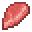

# Raw Giant Bat Meat

<small>[Tensura: Reincarnated](../../index.md) &rsaquo; [Items](../index.md) &rsaquo; [Miscellaneous](index.md)</small>

| | |
|---|---|
| **ID** | `tensura:raw_giant_bat_meat` |
| **Category** | Miscellaneous |
| **Magicule when dissolved** | 15 |

## Obtaining

### Loot

| Source | Count | Chance | Notes |
|---|---|---|---|
| Dropped by [Giant Bat](../../mobs/giant-bat.md) | 1-4 | 100% | More with Looting |

## Used in

[Cooked Giant Bat Meat](cooked-giant-bat-meat.md), [Dubious Food](dubious-food.md)

## Tags

`minecraft:meat`, `tensura:dubious/ingredient_effect`, `tensura:raw_monster_consumables`
