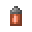
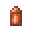
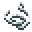
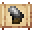

# Sticky Steel Web Cartridge

<small>[Tensura: Reincarnated](../../index.md) &rsaquo; [Items](../index.md) &rsaquo; [Miscellaneous](index.md)</small>

| | |
|---|---|
| **ID** | `tensura:sticky_steel_web_cartridge` |
| **Category** | Miscellaneous |
| **Stack size** | 16 |

## What it does

It is made at the Smithing Bench.

## Obtaining

### Recipes

**Smithing Bench** &rarr;  [Sticky Steel Web Cartridge](sticky-steel-web-cartridge.md)

Ingredients:  [Copper Shell](copper-shell.md),  [Sticky Thread](sticky-thread.md) x4,  [Steel Thread](steel-thread.md) x4,  [Gunpowder](https://minecraft.wiki/w/Gunpowder)

Requires schematic:  [Web Gun Schematic](../schematics/web-gun-schematic.md)
