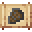

# Tempest Scale Shield

<small>[Tensura: Reincarnated](../../index.md) &rsaquo; [Items](../index.md) &rsaquo; [Miscellaneous](index.md)</small>

| | |
|---|---|
| **ID** | `tensura:tempest_scale_shield` |
| **Category** | Miscellaneous |
| **Durability** | 3,964 |
| **Fire resistant** | Yes |
| **Gear EP** | 60,000 - None |
| **Attack damage** | 15 |
| **Attack speed** | 1 |
| **Sweep damage** | -100% |

## What it does

A massive shield made from Charybdis scales (3,964 durability, doesn't burn). Hold right-click to block, and it hits hard as a weapon. Repair it with Charybdis Scales.

A weapon that deals **15** attack damage at **1** attack speed. It also has no sweeping attack. It is made at the Smithing Bench.

## Obtaining

### Recipes

**Smithing Bench** &rarr;  [Tempest Scale Shield](tempest-scale-shield.md)

Ingredients:  [Charybdis Scale](../materials/charybdis-scale.md) x6,  [High Magisteel Ingot](../materials/high-magisteel-ingot.md)

Requires schematic:  [Charybdis Scalemail Gear Schematic](../schematics/charybdis-scalemail-gear-schematic.md),  [Shield Schematic](../schematics/shield-schematic.md)

## Tags

`c:tools/shield`, `tensura:shields`
