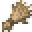
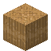

# Thatch

<small>[Tensura: Reincarnated](../../index.md) &rsaquo; [Items](../index.md) &rsaquo; [Miscellaneous](index.md)</small>

| | |
|---|---|
| **ID** | `tensura:thatch` |
| **Category** | Miscellaneous |

## What it does

Crafting material, used to make [Tatami Block](../../blocks/tatami-block.md), [Thatch Bed](../../blocks/thatch-bed.md), [Thatch Block](../../blocks/thatch-block.md) and [Training Dummy](../../blocks/training-dummy.md). It is crafted and found in 13 kinds of loot chest.

## Obtaining

### Recipes

**Crafting (shapeless)** &rarr;  [Thatch](thatch.md) x9

Ingredients:  [Thatch Block](../../blocks/thatch-block.md)

### Loot

| Source | Count | Chance | Notes |
|---|---|---|---|
| Chest: Acacia Goblin Village (`tensura:chests/acacia_goblin_village`) | 1 | 100% |  |
| Chest: Birch Goblin Village (`tensura:chests/birch_goblin_village`) | 1 | 100% |  |
| Chest: Jungle Goblin Village (`tensura:chests/jungle_goblin_village`) | 1 | 100% |  |
| Chest: Lizardman Bedroom (`tensura:chests/lizardman_bedroom`) | 1 | 100% |  |
| Chest: Lizardman Smithy (`tensura:chests/lizardman_smithy`) | 1 | 100% |  |
| Chest: Lizardman Storage (`tensura:chests/lizardman_storage`) | 1 | 100% |  |
| Chest: Lizardman Throne (`tensura:chests/lizardman_throne`) | 1 | 100% |  |
| Chest: Oak Goblin Village (`tensura:chests/oak_goblin_village`) | 1 | 100% |  |
| Chest: Palm Goblin Village (`tensura:chests/palm_goblin_village`) | 1 | 100% |  |
| Chest: Spruce Goblin Village (`tensura:chests/spruce_goblin_village`) | 1 | 100% |  |
| Chest: Dwarf Merchant (`tensura:chests/dwarf_merchant`) | 1 | 90% |  |
| Chest: Lizardman Tower (`tensura:chests/lizardman_tower`) | 1 | 80% |  |
| Chest: Dwarf Dojo (`tensura:chests/dwarf_dojo`) | 1 | 63% |  |

## Used in

[Tatami Block](../../blocks/tatami-block.md), [Thatch Bed](../../blocks/thatch-bed.md), [Thatch Block](../../blocks/thatch-block.md), [Training Dummy](../../blocks/training-dummy.md)

## Tags

`minecraft:cow_food`, `minecraft:goat_food`, `minecraft:sheep_food`
