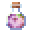

# Revival Elixir

<small>[Tensura: Reincarnated](../../index.md) &rsaquo; [Items](../index.md) &rsaquo; [Potions](index.md)</small>

| | |
|---|---|
| **ID** | `tensura:revival_elixir` |
| **Category** | Potions |
| **Magicule when dissolved** | 3 |

## What it does

A healing potion. Drinking it restores a share of your **max health** and some magicule:

| Potion | Health | Magicule |
|---|---|---|
| Low Potion | 33% | 100 |
| High Potion | 66% | 1,000 |
| Full Potion | 99% | 10,000 |
| Revival Elixir | 100% | 20,000 |

Sneak + right-click to throw it instead (it splashes nearby creatures), or use it on another creature to make it drink. You get the magic bottle back.

## Tags

`tensura:hipokute_potions`
