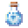

# Vacuumed Magic Bottle of Water

<small>[Tensura: Reincarnated](../../index.md) &rsaquo; [Items](../index.md) &rsaquo; [Potions](index.md)</small>

| | |
|---|---|
| **ID** | `tensura:vacuumed_magic_bottle_of_water` |
| **Category** | Potions |
| **Stack size** | 16 |

## What it does

Food. Used to make [Full Potion](full-potion.md), [High Potion](high-potion.md), [High Arcane Potion](high-arcane-potion.md) and [Medium Arcane Potion](medium-arcane-potion.md). It is smelted in a furnace, cooked on a campfire and cooked in a smoker.

## Obtaining

### Recipes

**Smelting** &rarr;  [Vacuumed Magic Bottle of Water](vacuumed-magic-bottle-of-water.md)

Ingredients:  [Magic Bottle of Water](magic-bottle-of-water.md)

**Campfire** &rarr;  [Vacuumed Magic Bottle of Water](vacuumed-magic-bottle-of-water.md)

Ingredients:  [Magic Bottle of Water](magic-bottle-of-water.md)

**Smoking** &rarr;  [Vacuumed Magic Bottle of Water](vacuumed-magic-bottle-of-water.md)

Ingredients:  [Magic Bottle of Water](magic-bottle-of-water.md)

## Used in

[Full Potion](full-potion.md), [High Potion](high-potion.md), [High Arcane Potion](high-arcane-potion.md), [Medium Arcane Potion](medium-arcane-potion.md)

## Tags

`tensura:hipokute_potion_containers`
