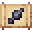

# Kunai Schematic

<small>[Tensura: Reincarnated](../../index.md) &rsaquo; [Items](../index.md) &rsaquo; [Schematics](index.md)</small>

| | |
|---|---|
| **ID** | `tensura:kunai_schematic` |
| **Category** | Schematics |
| **Stack size** | 16 |
| **Rarity** | Uncommon |
| **Fire resistant** | Yes |

## Tags

`tensura:schematics`
