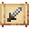

# Long Sword Schematic

<small>[Tensura: Reincarnated](../../index.md) &rsaquo; [Items](../index.md) &rsaquo; [Schematics](index.md)</small>

| | |
|---|---|
| **ID** | `tensura:long_sword_schematic` |
| **Category** | Schematics |
| **Stack size** | 16 |
| **Rarity** | Uncommon |
| **Fire resistant** | Yes |

## Obtaining

### Loot

| Source | Count | Chance | Notes |
|---|---|---|---|
| Chest: Dwarf Smithy (`tensura:chests/dwarf_smithy`) | 1 | 12% |  |

## Tags

`tensura:schematics`
