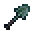

# Adamantite Shovel

<small>[Tensura: Reincarnated](../../index.md) &rsaquo; [Items](../index.md) &rsaquo; [Tools](index.md)</small>

| | |
|---|---|
| **ID** | `tensura:adamantite_shovel` |
| **Category** | Tools |
| **Fire resistant** | Yes |
| **Gear EP** | 225,000 - 750,000 |
| **Evolves into** | [Hihi'Irokane Shovel](hihiirokane-shovel.md) |

## Obtaining

### Recipes

**Smithing Bench** &rarr;  [Adamantite Shovel](adamantite-shovel.md)

Ingredients:  [Adamantite Ingot](../materials/adamantite-ingot.md),  [Stick](https://minecraft.wiki/w/Stick) x2

Requires schematic:  [Adamantite Gear Schematic](../schematics/adamantite-gear-schematic.md)

## Tags

`minecraft:shovels`, `tensura:adamantite_items`
