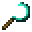

# Diamond Sickle

<small>[Tensura: Reincarnated](../../index.md) &rsaquo; [Items](../index.md) &rsaquo; [Tools](index.md)</small>

| | |
|---|---|
| **ID** | `tensura:diamond_sickle` |
| **Category** | Tools |
| **Attack damage** | 6 |
| **Attack speed** | 1.2 |
| **Tier** | Diamond |
| **Durability** | 1,561 |

## What it does

A sickle that deals **6** attack damage at **1.2** attack speed. Durability: **1,561**. It is crafted and made at the Smithing Bench.

## Obtaining

### Recipes

**Crafting (shaped)** &rarr;  [Diamond Sickle](diamond-sickle.md)

| | | |
|---|---|---|
|  [Diamond](https://minecraft.wiki/w/Diamond) |  [Diamond](https://minecraft.wiki/w/Diamond) |  [Diamond](https://minecraft.wiki/w/Diamond) |
|   |   |  [Stick](https://minecraft.wiki/w/Stick) |
|   |   |  [Stick](https://minecraft.wiki/w/Stick) |

**Smithing Bench** &rarr;  [Diamond Sickle](diamond-sickle.md)

Ingredients:  [Diamond](https://minecraft.wiki/w/Diamond) x3,  [Stick](https://minecraft.wiki/w/Stick) x2

Requires schematic:  [Diamond Gear Schematic](../schematics/diamond-gear-schematic.md)

## Used in

[Netherite Sickle](netherite-sickle.md)

## Tags

`tensura:sickles`
