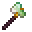

# High Magisteel Axe

<small>[Tensura: Reincarnated](../../index.md) &rsaquo; [Items](../index.md) &rsaquo; [Tools](index.md)</small>

| | |
|---|---|
| **ID** | `tensura:high_magisteel_axe` |
| **Category** | Tools |
| **Gear EP** | 18,000 - 52,000 |
| **Evolves into** | [Pure Magisteel Axe](pure-magisteel-axe.md) |
| **Attack damage** | 22 |
| **Attack speed** | 1.1 |
| **Tier** | High Magisteel |
| **Durability** | 2,500 |

## What it does

A axe that deals **22** attack damage at **1.1** attack speed. Durability: **2,500**. It is made at the Smithing Bench.

## Obtaining

### Recipes

**Smithing Bench** &rarr;  [High Magisteel Axe](high-magisteel-axe.md)

Ingredients:  [High Magisteel Ingot](../materials/high-magisteel-ingot.md) x3,  [Gold Ingot](https://minecraft.wiki/w/Gold_Ingot),  [Stick](https://minecraft.wiki/w/Stick) x2

Requires schematic:  [High Magisteel Gear Schematic](../schematics/high-magisteel-gear-schematic.md)

## Tags

`minecraft:axes`
