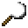

# Iron Sickle

<small>[Tensura: Reincarnated](../../index.md) &rsaquo; [Items](../index.md) &rsaquo; [Tools](index.md)</small>

| | |
|---|---|
| **ID** | `tensura:iron_sickle` |
| **Category** | Tools |

## Obtaining

### Recipes

**Crafting (shaped)** &rarr;  [Iron Sickle](iron-sickle.md)

| | | |
|---|---|---|
|  [Iron Ingot](https://minecraft.wiki/w/Iron_Ingot) |  [Iron Ingot](https://minecraft.wiki/w/Iron_Ingot) |  [Iron Ingot](https://minecraft.wiki/w/Iron_Ingot) |
|   |   |  [Stick](https://minecraft.wiki/w/Stick) |
|   |   |  [Stick](https://minecraft.wiki/w/Stick) |

**Smithing Bench** &rarr;  [Iron Sickle](iron-sickle.md)

Ingredients:  [Iron Ingot](https://minecraft.wiki/w/Iron_Ingot) x3,  [Stick](https://minecraft.wiki/w/Stick) x2

Requires schematic:  [Iron Gear Schematic](../schematics/iron-gear-schematic.md)

## Tags

`tensura:sickles`
