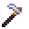

# Mithril Hoe

<small>[Tensura: Reincarnated](../../index.md) &rsaquo; [Items](../index.md) &rsaquo; [Tools](index.md)</small>

| | |
|---|---|
| **ID** | `tensura:mithril_hoe` |
| **Category** | Tools |
| **Gear EP** | 45,000 - 225,000 |
| **Evolves into** | [Adamantite Hoe](adamantite-hoe.md) |
| **Attack damage** | 17 |
| **Attack speed** | 1 |
| **Tier** | Mithril |
| **Durability** | 2,700 |

## What it does

A hoe that deals **17** attack damage at **1** attack speed. Durability: **2,700**. It is made at the Smithing Bench.

## Obtaining

### Recipes

**Smithing Bench** &rarr;  [Mithril Hoe](mithril-hoe.md)

Ingredients:  [Mithril Ingot](../materials/mithril-ingot.md) x2,  [Gold Ingot](https://minecraft.wiki/w/Gold_Ingot),  [Stick](https://minecraft.wiki/w/Stick) x2

Requires schematic:  [Mithril Gear Schematic](../schematics/mithril-gear-schematic.md)

## Tags

`minecraft:hoes`
