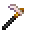

# Pure Magisteel Hoe

<small>[Tensura: Reincarnated](../../index.md) &rsaquo; [Items](../index.md) &rsaquo; [Tools](index.md)</small>

| | |
|---|---|
| **ID** | `tensura:pure_magisteel_hoe` |
| **Category** | Tools |
| **Gear EP** | 52,000 - 225,000 |
| **Evolves into** | [Adamantite Hoe](adamantite-hoe.md) |

## Obtaining

### Recipes

**Smithing Bench** &rarr;  [Pure Magisteel Hoe](pure-magisteel-hoe.md)

Ingredients:  [Pure Magisteel Ingot](../materials/pure-magisteel-ingot.md) x2,  [Gold Ingot](https://minecraft.wiki/w/Gold_Ingot),  [Stick](https://minecraft.wiki/w/Stick) x2

Requires schematic:  [Pure Magisteel Gear Schematic](../schematics/pure-magisteel-gear-schematic.md)

## Tags

`minecraft:hoes`
