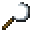

# Silver Sickle

<small>[Tensura: Reincarnated](../../index.md) &rsaquo; [Items](../index.md) &rsaquo; [Tools](index.md)</small>

| | |
|---|---|
| **ID** | `tensura:silver_sickle` |
| **Category** | Tools |
| **Gear EP** | 0 - 0 |
| **Attack damage** | 5 |
| **Attack speed** | 1.2 |
| **Tier** | Silver |
| **Durability** | 150 |

## What it does

A sickle that deals **5** attack damage at **1.2** attack speed. Durability: **150**. It is crafted and made at the Smithing Bench.

## Obtaining

### Recipes

**Crafting (shaped)** &rarr;  [Silver Sickle](silver-sickle.md)

| | | |
|---|---|---|
|  [Silver Ingot](../materials/silver-ingot.md) |  [Silver Ingot](../materials/silver-ingot.md) |  [Silver Ingot](../materials/silver-ingot.md) |
|   |   |  [Stick](https://minecraft.wiki/w/Stick) |
|   |   |  [Stick](https://minecraft.wiki/w/Stick) |

**Smithing Bench** &rarr;  [Silver Sickle](silver-sickle.md)

Ingredients:  [Silver Ingot](../materials/silver-ingot.md) x3,  [Stick](https://minecraft.wiki/w/Stick) x2

Requires schematic:  [Silver Gear Schematic](../schematics/silver-gear-schematic.md)

## Tags

`tensura:sickles`
