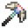
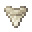

# Sissie Tooth Pickaxe

<small>[Tensura: Reincarnated](../../index.md) &rsaquo; [Items](../index.md) &rsaquo; [Tools](index.md)</small>

| | |
|---|---|
| **ID** | `tensura:sissie_tooth_pickaxe` |
| **Category** | Tools |
| **Gear EP** | 18,000 - None |

## Obtaining

### Recipes

**Smithing Bench** &rarr;  [Sissie Tooth Pickaxe](sissie-tooth-pickaxe.md)

Ingredients:  [Sissie Tooth](../miscellaneous/sissie-tooth.md) x2,  [High Magisteel Ingot](../materials/high-magisteel-ingot.md),  [Stick](https://minecraft.wiki/w/Stick) x2

Requires schematic:  [High Magisteel Gear Schematic](../schematics/high-magisteel-gear-schematic.md)

## Tags

`minecraft:enchantable/sharp_weapon`, `minecraft:enchantable/sword`, `minecraft:pickaxes`
