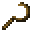

# Wooden Sickle

<small>[Tensura: Reincarnated](../../index.md) &rsaquo; [Items](../index.md) &rsaquo; [Tools](index.md)</small>

| | |
|---|---|
| **ID** | `tensura:wooden_sickle` |
| **Category** | Tools |
| **Attack damage** | 3 |
| **Attack speed** | 1.2 |
| **Tier** | Wood |
| **Durability** | 59 |

## What it does

A sickle that deals **3** attack damage at **1.2** attack speed. Durability: **59**. It is crafted.

## Obtaining

### Recipes

**Crafting (shaped)** &rarr;  [Wooden Sickle](wooden-sickle.md)

| | | |
|---|---|---|
|  `#minecraft:planks` |  `#minecraft:planks` |  `#minecraft:planks` |
|   |   |  [Stick](https://minecraft.wiki/w/Stick) |
|   |   |  [Stick](https://minecraft.wiki/w/Stick) |

## Tags

`tensura:sickles`
