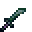

# Adamantite Kodachi

<small>[Tensura: Reincarnated](../../index.md) &rsaquo; [Items](../index.md) &rsaquo; [Weapons](index.md)</small>

| | |
|---|---|
| **ID** | `tensura:adamantite_kodachi` |
| **Category** | Weapons |
| **Fire resistant** | Yes |
| **Gear EP** | 225,000 - 750,000 |
| **Evolves into** | [Hihi'Irokane Kodachi](hihiirokane-kodachi.md) |
| **Attack damage** | 48 |
| **Attack speed** | 2 |
| **Tier** | Adamantite |
| **Durability** | 3,200 |

## What it does

A kodachi that deals **48** attack damage at **2** attack speed. It also has -0.75 blocks of reach, +20% critical hit chance, +0.5 critical damage multiplier and no sweeping attack. Durability: **3,200**. It is made at the Smithing Bench.

## Obtaining

### Recipes

**Smithing Bench** &rarr;  [Adamantite Kodachi](adamantite-kodachi.md)

Ingredients:  [Adamantite Ingot](../materials/adamantite-ingot.md),  [Stick](https://minecraft.wiki/w/Stick)

Requires schematic:  [Adamantite Gear Schematic](../schematics/adamantite-gear-schematic.md),  [Short Sword Schematic](../schematics/short-sword-schematic.md),  [Japanese Sword Schematic](../schematics/japanese-sword-schematic.md)

## Tags

`tensura:adamantite_items`, `tensura:kodachis`
