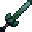

# Adamantite Long Sword

<small>[Tensura: Reincarnated](../../index.md) &rsaquo; [Items](../index.md) &rsaquo; [Weapons](index.md)</small>

| | |
|---|---|
| **ID** | `tensura:adamantite_long_sword` |
| **Category** | Weapons |
| **Fire resistant** | Yes |
| **Gear EP** | 225,000 - 750,000 |
| **Evolves into** | [Hihi'Irokane Long Sword](hihiirokane-long-sword.md) |

## Obtaining

### Recipes

**Smithing Bench** &rarr;  [Adamantite Long Sword](adamantite-long-sword.md)

Ingredients:  [Adamantite Ingot](../materials/adamantite-ingot.md) x3,  [Stick](https://minecraft.wiki/w/Stick)

Requires schematic:  [Adamantite Gear Schematic](../schematics/adamantite-gear-schematic.md),  [Long Sword Schematic](../schematics/long-sword-schematic.md)

## Tags

`tensura:adamantite_items`, `tensura:long_swords`
