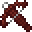

# Ant Crossbow

<small>[Tensura: Reincarnated](../../index.md) &rsaquo; [Items](../index.md) &rsaquo; [Weapons](index.md)</small>

| | |
|---|---|
| **ID** | `tensura:ant_crossbow` |
| **Category** | Weapons |
| **Durability** | 960 |
| **Gear EP** | 3,000 - None |

## What it does

It is made at the Smithing Bench.

## Obtaining

### Recipes

**Smithing Bench** &rarr;  [Ant Crossbow](ant-crossbow.md)

Ingredients:  [Giant Ant Leg](../miscellaneous/giant-ant-leg.md) x3,  [Steel Thread](../miscellaneous/steel-thread.md) x2,  [Tripwire Hook](https://minecraft.wiki/w/Tripwire_Hook),  [Iron Ingot](https://minecraft.wiki/w/Iron_Ingot)

Requires schematic:  [Ant Carapace Gear Schematic](../schematics/ant-carapace-gear-schematic.md)

## Tags

`c:tools/crossbow`, `minecraft:enchantable/crossbow`, `minecraft:enchantable/durability`
